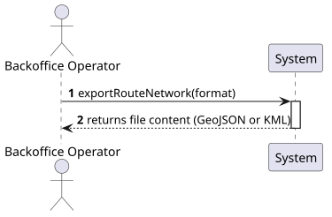
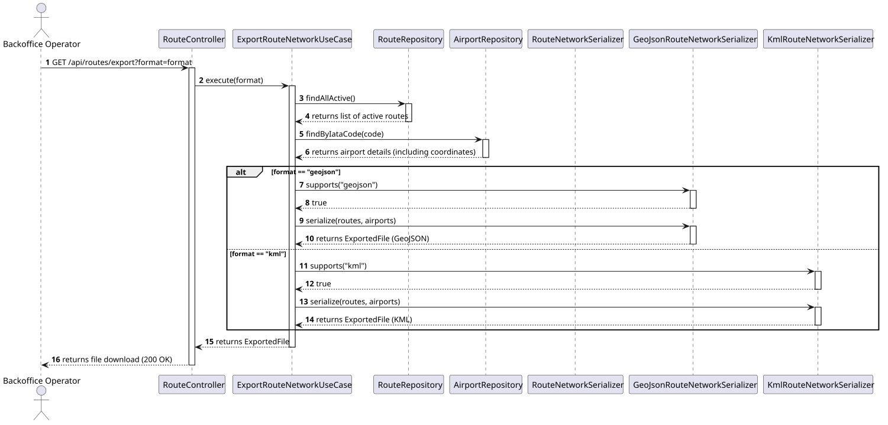

# US228 - Export route network data

## 1. Description
As a Backoffice Operator, I want to export route network data in standard aviation formats (GeoJSON, KML) so that I can visualize the network in external GIS tools.

This is a bonus use case.

### 1.1 Acceptance Criteria
- Support for GeoJSON export.
- Support for KML export.
- Coordinates must be fetched from the Airport context/aggregate.
- Integration test verifies the download endpoint.

## 2. Design

### 2.1 System Sequence Diagram (SSD)

### 2.2 Sequence Diagram (SD)

## 3. Implementation details

The implementation follows a strategy pattern for serializers. The `ExportRouteNetworkUseCase` coordinates the process:
1. Fetches all active routes.
2. Extracts unique airport IATA codes from those routes.
3. Fetches `Airport` aggregates (containing `Coordinates`) for all involved airports.
4. Delegates serialization to the appropriate `RouteNetworkSerializer` implementation based on the requested format.

### Serialization Formats
- **GeoJSON:** Encoded using Jackson. Features are `LineString` representing the routes.
- **KML:** Encoded using the `JavaAPIforKml` (JAK) library. Routes are represented as `Placemark` with `LineString`.

### Endpoint
`GET /api/routes/export?format={geojson|kml}`
- Default format: `geojson`
- Response: Binary file with appropriate Content-Type and Content-Disposition headers.
