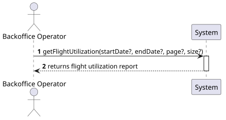
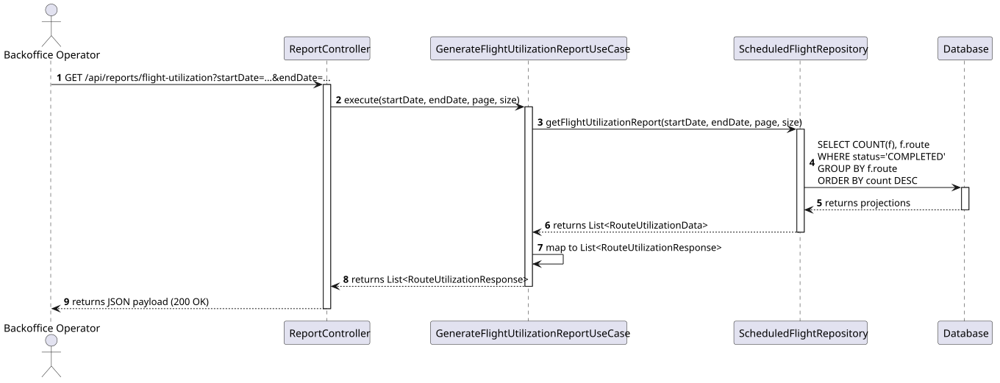

# US229 - Generate flight utilization reports

## 1. Description
As a Backoffice Operator, I want to generate flight utilization reports showing which routes are most frequently flown so that I can optimize the network based on demand.

This is a bonus use case.

### 1.1 Acceptance Criteria
- GET endpoint `/api/flights/reports/utilization` with optional `startDate` and `endDate`.
- Report includes: `routeId`, `origin`, `destination`, and count of completed flights.
- Results sorted by frequency (descending).
- Return HTTP 200 with JSON payload.
- Database-level aggregation (SQL COUNT/GROUP BY) for performance.
- Unit/Integration tests covering the aggregation logic and date filtering.

## 2. Design

### 2.1 System Sequence Diagram (SSD)

### 2.2 Sequence Diagram (SD)

## 3. Implementation details

The implementation provides an API endpoint that leverages a database-level aggregation to ensure performance even with a high volume of flight records.

1.  **Endpoint**: `GET /api/flights/reports/utilization?startDate={startDate}&endDate={endDate}&page={page}&size={size}`
2.  **Date Filtering**: Both `startDate` and `endDate` are optional. If provided, the system filters flights based on `departureDateTime >= startDate` and `arrivalDateTime <= endDate`.
3.  **Aggregation**: A JPA projection `RouteUtilizationProjection` is used to directly map the result of the `COUNT` and `GROUP BY` SQL query into the domain record `RouteUtilizationData`. The Use Case then maps this domain representation to the final `RouteUtilizationResponse` DTO for the controller.
4.  **Pagination**: Pagination is supported natively by the Spring Data repository via `Pageable`.
